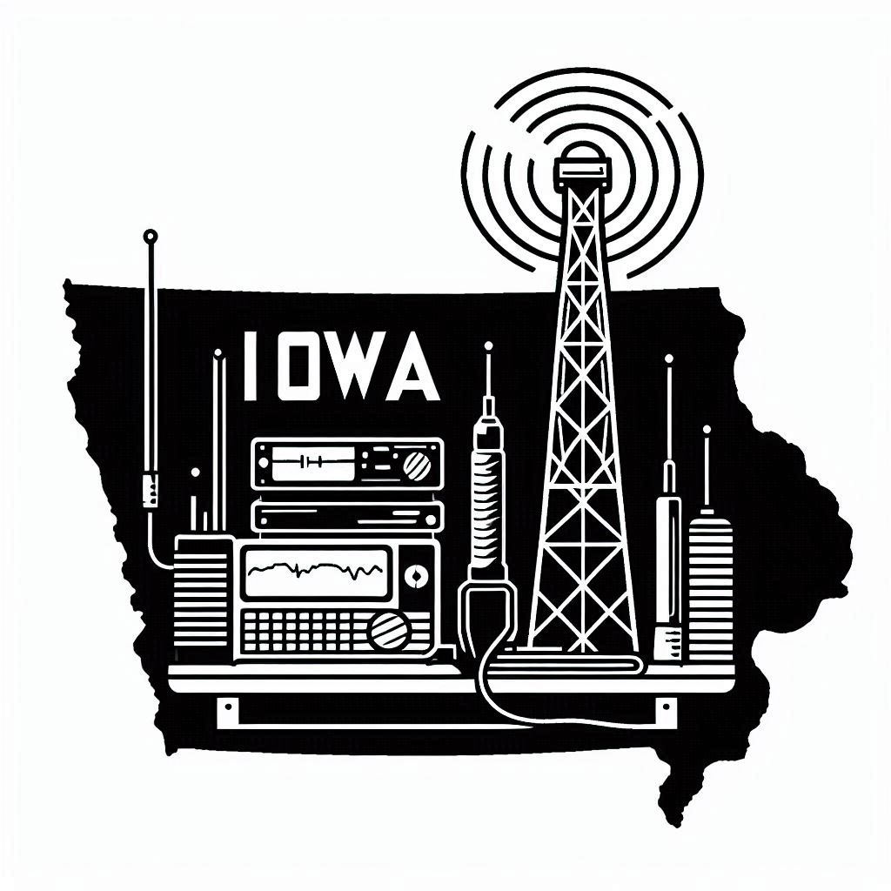

# 

**Iowa Radio Operators Club**

**Charter and Bylaws**

Table of Contents

[Introduction](#introduction)

> [Mission Statement](#mission-statement)
>
> [Vision Statement](#vision-statement)

[Leadership](#leadership)

> [President](#president)
>
> [Vice President](#vice-president)
>
> [Secretary & Treasurer](#secretary-treasurer)
>
> [Community Relations & Marketing](#community-relations-marketing)
>
> [Leadership: Vote of No Confidence](#leadership-vote-of-no-confidence)
>
> [Member Responsibilities & Code of Conduct](#member-responsibilities-code-of-conduct)

[Club Assets (Equipment, Property, and Documentation)](#club-assets-equipment-property-and-documentation)

[Club Financial Assets (Treasury, Revenue, and Expenses)](#club-financial-assets-treasury-revenue-and-expenses)

[Membership](#membership)

[Meetings and Regular Business](#meetings-and-regular-business)

[Updates or Modifications to Bylaws](#updates-or-modifications-to-bylaws)

[Adoption and Certification](#adoption-and-certification)

[Amendments and Revision History](#amendments-and-revision-history)

### **Introduction:**

Iowa Radio Operators is built on the foundation of community. That
community, bringing "any radio operator" together, continues in the form
of an official club to give radio operators around the state of Iowa who
do not have access to a local club a place to grow within the craft. The
official Iowa Radio Operators Radio club will not replace a local club.
Instead, we would love the opportunity to partner with that local club
and if applicable, be a resource to bring operators together from across
the state! Additionally, the Iowa Radio Operators Discord group will
continue to operate independently of the official club, remaining a
vibrant space for conversation, knowledge sharing, and camaraderie.

#### **Mission Statement:**

Iowa Radio Operators Radio Club fosters a statewide community of radio
enthusiasts by providing education, collaboration, and resources for
operators who may not have access to a local club. We strive to connect,
support, and grow the amateur radio community in Iowa while partnering
with existing clubs to enhance the shared experience of learning and
communication.

#### **Vision Statement:**

To be a unifying hub for radio operators across Iowa, promoting
knowledge-sharing, technical innovation, and a strong sense of
community. We envision a network of operators working together to
advance the craft, support local clubs, and create opportunities for
growth and engagement in amateur radio.

### Leadership:

The mantle of leadership is not always an easy task. Leaders will be
expected to carry out the mission and vision of the club and make sure
that the needs of the members and the club assets are met. This is
easiest when everyone is on the same page and can work in unison for the
common goal. In the initial phases of the club, there will be 4 major
areas of leadership.

President

Vice President

Secretary & Treasurer

Community Relations & Marketing

These positions will hold a 3-year term and will be voted on by current
members of the club. A term will be considered as [May 1st through April
30th]{.mark} with the respective term of service (IE: May 1st 2025 to
April 30th 2026). Should a member of the leadership team leave before
their term comes up, a special election will be held to fill out their
**current term**. At which point the term for that is up and will be
open again for election. The individual who held the remaining part of
that term is allowed to be elected for that role again without any
penalties for the next term. Succession Planning Here

[If a leader is unable to fulfill their assigned duties for an extended
period (60 days or more), the remaining leaders may vote to replace the
absent individual. If an immediate need arises or no volunteers come
forward, club leadership may appoint an interim replacement as
necessary. A Special Election by the club members will be conducted
electronically, and the elected individual will serve the remainder of
the current term. Once the term concludes, they may seek reelection
without penalty.]{.mark}

[When a role is up for reelection, nominations can be entered starting
January 1st and will remain open until March 31st. Nominations should be
those who are active members of the club and hold an active amateur or
active GMRS radio license (This means the individual should not be in
their grace period either). Failure to comply with this will disqualify
you from the nominations. Once nominations are closed, the individuals
who were nominated have the chance to put out documentation as to why
they think they are the best candidate for the role. Voting will be
conducted electronically on April 2nd and will remain open for 48 hours
for individuals to vote. The majority vote will be declared the winner,
and the new occupant of the role will start on May 1st. At the start of
the term for the role, the individual will assume responsibility and
begin enacting the function of the role.]{.mark}

The role of each leader is defined, but not exclusively, herein:

#### **President**

- Establish the club\'s objectives and work with the team to develop a clear mission and long-term goals.

- Foster a welcoming and inclusive environment for all members, encouraging active participation.

- Act as the primary representative of the club at events, meetings, and with external organizations.

- Build partnerships with local clubs, regional groups, and national amateur radio organizations.

- Lead and moderate club meetings to ensure productive discussions and decision-making.

- Prepare agendas, collaborate with the executive committee, and keep meetings on schedule.

- Resolve conflicts within the club, ensuring fair and impartial decision-making.

- Address challenges or hurdles faced by the club, whether logistical, technical, or administrative.

#### **Vice President**

- Act as a dependable second-in-command, assisting the president incarrying out the club's mission and goals.

- Step into lead meetings and represent the club when the president is unavailable.

- Collaborate with the team to organize and oversee club events, such as contests, workshops, and community outreach initiatives.

- Take the lead on specific projects or events, ensuring their success.

- Foster strong connections with current members and help onboard new members.

- Coordinate various committees or sub-groups within the club, ensuring their efforts align with the club's objectives.

- Act as a liaison between committees and the executive board.

- Help mediate disputes among members, providing impartial support to maintain harmony within the club.

- Work closely with the president and other officers to ensure clear and open communication within the executive board and with club members.

#### **Secretary & Treasurer** {#secretary-treasurer}

- Record and maintain accurate minutes for all club meetings, ensuring decisions and actions are documented.

- Prepare and distribute meeting agendas in coordination with the president.

- Maintain up-to-date membership records, including contact information and license statuses.

- Keep track of club bylaws, policies, and important documents.

- Serve as the primary point of contact for official club correspondence, including emails and announcements.

- Distribute information to members regarding upcoming meetings, events, or changes in club activities.

- Handle any required filings or communications with regulatory bodies or organizations (e.g., ARRL affiliation or FCC updates).

<!-- -->

- Prepare regular financial reports to present at club meetings, providing transparency to members.

- Keep detailed records of all transactions, receipts, and financial documents.

- Handle any required tax filings or financial disclosures, ensuring the club adheres to legal and regulatory standards.

#### **Community Relations & Marketing** {#community-relations-marketing}

- Build relationships with local organizations, schools, and other radio clubs to foster partnerships and collaboration.

- Represent the club at community events, ensuring a positive and professional presence.

- Organize activities that strengthen the sense of community, such as meet-ups, workshops, or team-building events.

- Promote amateur radio to the general public through demonstrations, presentations, or hands-on activities.

- Coordinate and publicize the club's involvement in community service  projects, such as providing communication support during emergencies or events.

<!-- -->

- Develop and maintain the club's branding, including logos, slogans, and overall public image.

- Create engaging promotional materials, including flyers, brochures, and social media posts.

- Maintain and update the club\'s website, ensuring it serves as a resource for members and newcomers alike.

- Manage the club's social media accounts to share updates, events, and news.

- Use platforms like Facebook, X (formerly Twitter), or Instagram to attract new members and engage with the broader amateur radio community.

- Promote club events, such as Field Day, contests, or community
 gatherings, to ensure strong turnout and visibility.

Our intention with the leadership is that these 4 main areas could form
and lead a subcommittee if required for a need or event. The 4 areas of
leadership could also form multiple short-term committees or potential
long-term committees to serve a need, but they need to maintain
leadership over that committee. If a subcommittee is formed, it should
be documented in official format stating the nature of its needs and
members, and be reviewed quarterly to ensure its needs are still
appropriate, its members are still appropriate, or if it should be
formally closed.

#### **Leadership: Vote of No Confidence**

[While club politics are inevitable, the bylaws and charter exist to
provide a clear, enforceable process should internal conflicts escalate
to the point where a vote of no confidence is required. The
circumstances surrounding this effort should be reasonable and not of
simple pettiness (IE, we don't like the individual, or hair color). This
measure is considered an absolute last resort and should only be invoked
in extreme circumstances. Given that there are four major leadership
positions, a quorum of three members is sufficient to initiate the
process; however, this quorum **must be unanimous** in its decision to
proceed. A neutral party must also be agreed upon during this unanimous
vote to moderate the hearing. Both conditions must be met before a
formal hearing will be conducted. If a vote of no confidence is
initiated, a special membership hearing will be convened. During this
hearing, the grievances against the individual will be formally
presented, with supporting evidence provided to substantiate the claims.
The individual in question will have a single opportunity to respond to
these accusations in a structured and respectful manner. This step is
not intended to serve as a debate but as a definitive airing of the
issues at hand. After all grievances have been fully documented and
responses provided, a formal vote will be held among the active members.
Club leaders will not participate in the vote. Members must be present
at the meeting and in good standing with the club to vote on the outcome
of the grievances. The action will be carried forward with a 2/3rds
majority vote of those present. Once the result is decided, it will be
deemed binding and final, leaving no room for appeal or
reconsideration.]{.mark}

This section of the bylaw surrounding the vote of no confidence is
**non-negotiable**---it **cannot** be altered under any circumstances.
Any attempt to modify or challenge this section will result in
**immediate removal** from the individual's current position and a
**permanent ban** from holding any future leadership or subcommittee
role within the club.

#### Member Responsibilities & Code of Conduct {#member-responsibilities-code-of-conduct}

[As members of this club, we uphold the values of respect, integrity,
and professionalism in all interactions. Each individual is expected to
conduct themselves with honor, fairness, and courtesy, fostering an
environment of collaboration and mutual support.]{.mark}

[Disrespectful, dishonest, or disruptive behavior undermines the spirit
of our community and will not be tolerated. If a member fails to adhere
to these standards, club leadership reserves the right to take
appropriate action, including warnings, removal, or permanent banning
from the club. The leadership will take a united front and unanimously
agree to the future involvement of the individual in question. If an
incident escalates to the level of legal action of any kind, the
individual will be immediately expelled, without exception.]{.mark}

[Together, we commit to maintaining a space where every member feels
valued, supported, and empowered to contribute positively.]{.mark}

### **Club Assets (Equipment, Property, and Documentation)**

All equipment, property, and other designated assets used by the
organization fall into one of two categories: **club-owned assets** and
**loaned assets**.

1.  **Club-Owned Assets:** Any equipment or property purchased using
   funds from the organization\'s treasury is the sole property of
   the club. No individual member, including trustees or their
   successors, shall claim ownership rights over such assets. This
   includes any property and/or equipment gifted in kind to Iowa
   Radio Operators.

2.  **Loaned Assets:** Any equipment or property loaned to the club by
   an individual member or trustee remains the property of the
   lender. The club and its members acquire no ownership rights
   through its use, and the ownership of the trustee remains fully
   intact.

To ensure proper record-keeping, the **Treasurer** is responsible for
maintaining detailed documentation of all club-owned and loaned assets.
This includes tracking purchases, recording loan agreements, and
ensuring the proper return of loaned equipment when requested by the
owner.

In the event the club is disbanded, the member (or the member\'s family)
who donated the equipment will have the opportunity to reclaim the
donated assets. These members will have 14 days to claim these items or
request that they be donated to other club members. If the owner of the
asset does not respond within 14 days or chooses to donate the item to
another member, the asset will be offered to existing club members on a
first-come, first-served basis.

### Club Financial Assets (Treasury, Revenue, and Expenses)

All financial assets the organization holds fall into one of two
categories: club-generated funds and donated funds.

1.  **Club-Generated Funds:** Any revenue derived from membership dues,
   fundraising activities, grants, or other sources directly managed
   by the club shall remain under the sole control of the
   organization. No individual member, including trustees or
   officers, may claim personal ownership over such funds.

2.  **Donated Funds:** Any financial contributions given to the club,
   whether by individuals or external organizations, are considered
   club assets upon receipt. Donors may specify the intended use of
   funds, and the club shall make reasonable efforts to honor such
   designations. If a donation does not have a specified purpose, it
   may be used at the discretion of the club's leadership to further
   the organization\'s mission.

The Treasurer is responsible for maintaining transparent and accurate
financial records, tracking income, expenses, and designated funds. An
annual financial report shall be presented to the membership, outlining
the club's fiscal status. All expenditures must follow predefined
approval procedures, with larger expenses requiring formal authorization
to ensure proper oversight.

In the event the club is disbanded, remaining financial assets will
first be used to settle outstanding debts. Any remaining funds will then
be distributed in a manner consistent with the club's mission. If
applicable, donors of restricted funds will be contacted regarding
alternative allocation or refund options.

### **Membership**

Membership is available to all licensed amateur operators and GMRS
operators in good standing with their respective licensing entities. If
any questions arise, please let a leadership team member know, and
exceptions can be reviewed on a case-by-case basis.

The fiscal year will follow a calendar year, going from January 1st
through December 31st. This means that all membership dues will be
collected on the 1st of the year or shortly after. If a member joins
after the 1st of the year, a prorated amount of dues may be collected.
All dues will be given to the Treasurer. Please note this with the
registration, and it will be addressed at that time.

Dues will be collected in the amount of \$20.00.

Additional considerations will be given for immediate family members,
living in the same household who wish to join the club. Discounts will
be available for additional immediate family members to encourage
broader participation within the same household.

Dues for additional family members will be collected in the amount of
\$5.00.

Charter members will be granted a lifetime membership to the club. This
membership is exclusive to the individual and cannot be transferred to
other members or family. It is a recognition of their foundational
contributions and enduring commitment to the club\'s values.

### **Meetings and Regular Business**

Active members have the right to vote on all club matters, with
decisions determined by a simple majority. Club business will be
presented during meetings and decided through a **clear \"Yay\" or
\"Nay\" vote**. However, any attending member may propose postponing a
vote to the next meeting to allow for further review, research, or
discussion. This motion to defer must be approved by a majority of
members present. In the event there is a tie in the voting, the
president shall have the final vote and say in the matter. It should be
noted in the minutes that the vote was tied and the president was
required to exercise their final vote.

If a special meeting or vote is required, an official notice will be
sent via email to all active members, clearly outlining the purpose of
the meeting and providing a reasonable timeframe for participation. To
accommodate members across the state, a digital attendance option will
be made available, ensuring equal access and engagement.

Meetings will be conducted by the club President and in the fashion of
Robert\'s Rules of Order. In the event the club President is unavailable
during the regular scheduled meeting time, the Vice President will
assume the responsibility to conduct the meeting. Unless otherwise
specified, meetings will need to be conducted no less than quarterly.
More frequent meetings would be desired, but the bylaws need to
acknowledge that this is not everyone\'s day job and will need to offer
flexibility to those who need it.

Meeting minutes will be recorded for each meeting, including all
discussed topics, decisions made, and assigned action items. A record of
attendees will also be maintained, along with any relevant voting
details if votes were conducted during the meeting. Meeting minutes will
be made publicly available and posted on the website at the earliest
opportunity.

Members, whether attending in person or digitally, are expected to
conduct themselves professionally. Disruptive or inappropriate behavior
will result in removal from the meeting and a leadership review to
determine future participation in public meetings and voting. While we
respect every member's right to vote on club matters, negativity and
misconduct will not be tolerated.

To ensure accessibility, voting may be conducted outside of meetings
through approved digital or remote voting methods as determined by club
leadership. However, members who engage in repeated misconduct or
violate club policies may have their voting rights temporarily
suspended, pending a formal review and decision by the leadership team.

###  {#section-21}

### **Updates or Modifications to Bylaws**

Any member of the organization may submit recommendations for updates or
modifications to the bylaws. These recommendations will be reviewed by
the current leadership team, who will assess their impact and relevance.
The leadership team will then hold a vote to approve or reject the
proposed changes. In the event of a tie, the current President will
determine next steps for the proposal, which may include approving,
vetoing, or requesting a vote from the active members of the club in a
special election.

The leadership\'s decision on any updates or modifications to the bylaws
will be final. Members will be informed of the vote outcomes, but the
final authority rests with the leadership team to ensure the bylaws
remain in line with the organization\'s goals and operational needs.

### Adoption and Certification

These bylaws were reviewed and formally adopted by the leadership of
Iowa Radio Operators on May 26th, 2025. This document reflects the
governing principles and operational guidelines agreed upon by the
organization.

**Certified by:**

 **Calvin Jutting / KN0CTJ** -- President  
**Jason Knapton / KE0EJS** -- Vice President  
**Jason Loehr / KD0MUB** -- Secretary & Treasurer  
**Ben Jutting / K0BJJ** -- Marketing & Communications

### Amendments and Revision History

A majority vote of the leadership may amend these bylaws in accordance
with the club's governance procedures (excluding any terms that can not
be changed by any vote; IE Vote of No Confidence). Any changes shall be
recorded below, indicating the date of the amendment and a summary of
the modification.

**Revision Log:**

**Certified by:**
